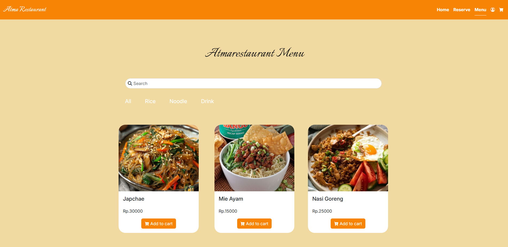
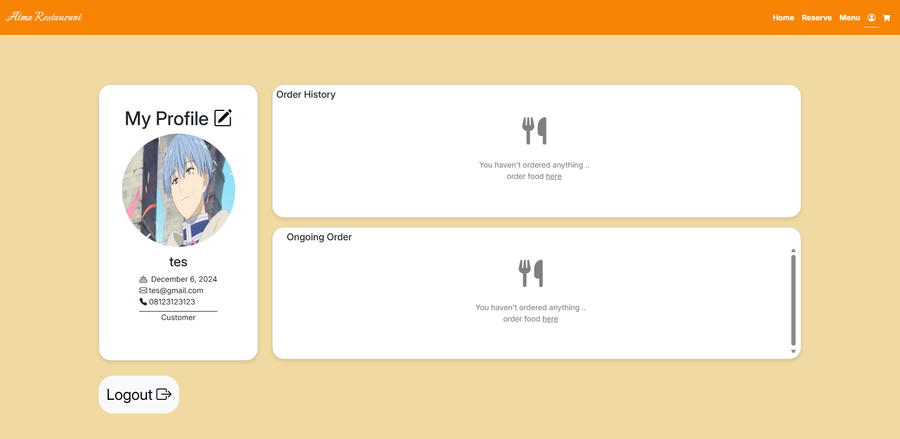
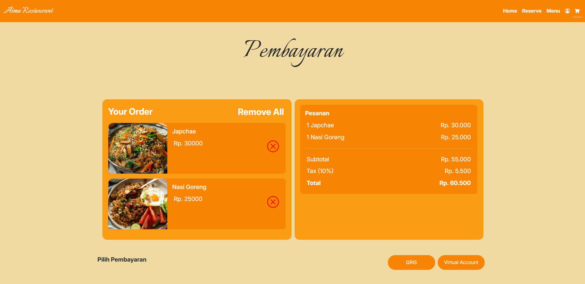
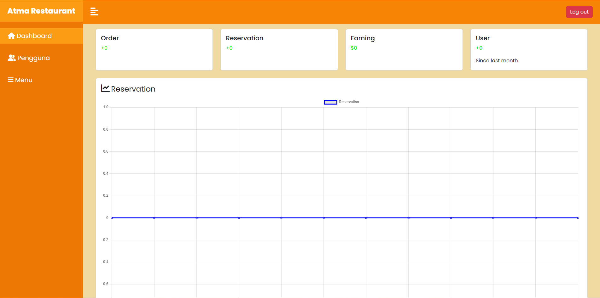
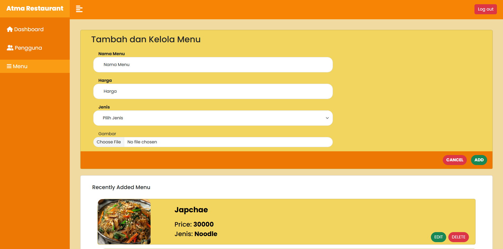

### Atma Restaurant

   Atma Restaurant is a restaurant management system built with Laravel. It is designed to streamline restaurant operations, including menu management, order processing, and transaction reporting. The project follows the MVC architecture and provides a user-friendly web interface for both administrators and staff.

### Group Member :
- Christopher William (220711839) - backend & frontend
- Kalvin Lawinata (220711659) - backend & frontend
- Jeany Florencia (220712030) - design & support
- Keefe Melvern (220711887) - design & backend

### Login & Register

### User Interface

### Admin Interface

